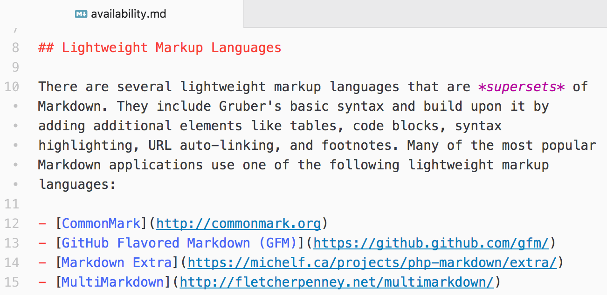
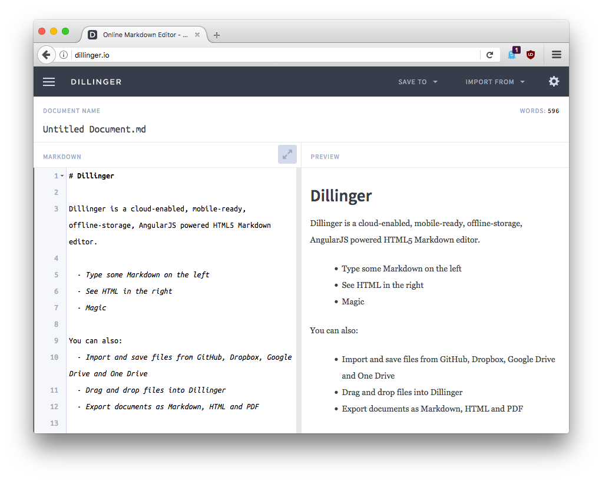
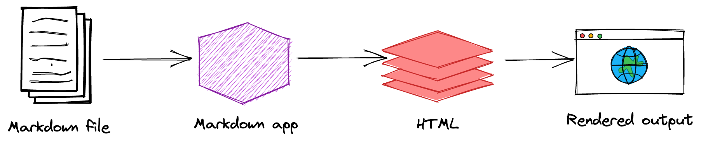

{mainmatter}

# Начало {#getting-started}

Markdown - это легковесный язык разметки, который можно использовать для добавления элементов форматирования в обычные текстовые документы. Созданный Джоном Грубером в 2004 году, Markdown стал одним из самых популярных языков разметки в мире.

Использование Markdown отличается от использования [WYSIWYG](https://en.wikipedia.org/wiki/WYSIWYG) редакторов. В приложении аналогичном Microsoft Word вы щелкаете на кнопки, чтобы отформатировать слова и фразы, и изменения сразу же становятся видны. Markdown работает не так. При создании файла в формате Markdown вы добавляете синтексис Markdown в текст для указания того, какие слова и фразы должны ваглядеть по другому.

Например, чтобы указать заголовок, вы добавляете знак решетки перед ним(например, `# Первый заголовок`). Чтобы выделить фразу полужирным шрифтом, нужно добавить две звездочки до и после фразы (например, `**этот текст полужирный**`). Чтобы привыкнуть видеть синтаксис Markdown в тексте необходимо некоторое время, особенно если вы привыкли к приложениям WYSIWYG. На рисунке ниже показан файл Markdown, отображаемый в окне [текстового редактора Atom](https://atom.io).

Элементы форматирования разметки можно добавить в текстовый файл при помощи текстового редактора. Или вы можете использовать одно из многих приложений Markdown для операционных систем macOS, Windows, Linux, iOS и Android. Есть также несколько веб-приложений, специально предназначенных редактирования Markdown.

В зависимости от используемого приложения может оказаться невозможным предварительный просмотр документа в режиме реального времени. Но все в порядке. [Согласно Груберу](http://daringfireball.net/projects/markdown/), синтаксис Markdown разработан для того, чтобы быть читаемым и ненавязчивым, так что текст в файлах Markdown может быть прочитан, даже если он не обработан.

> Главная цель дизайна синтаксиса форматирования Markdown - сделать его как можно более читаемым. Идея заключается в том, что документ Markdown может быть напечатан как обычный текст, не смотря на то, что он был помечен тегами или инструкциями по форматированию.

## Зачем использовать Markdown?

Вам может быть интересно, почему люди используют Markdown вместо редактора WYSIWYG. Зачем писать при помощи Markdown, если можно нажать кнопки в интерфейсе, чтобы отформатировать текст? Как оказалось, есть несколько причин, почему люди используют Markdown вместо редакторов WYSIWYG.

- Markdown может быть использован для всего. Люди используют его для создания веб-сайтов, документов, заметок, книг, презентаций, сообщений электронной почты и технической документации.

- Markdown - переносимый формат. Файлы, содержащие текст в формате разметки, могут быть открыты с помощью любого приложения. Если вам не нравится программа для редактирования Markdown, которую вы сейчас используете, вы можете импортировать файлы Markdown в любое другое анологичное приложение. Это резко контрастирует с текстовыми процессорами, такими как Microsoft Word, которые блокируют ваш контент в проприетарном файловом формате.

- Markdown - платформонезависимый формат. Вы можете создать текст в формате Markdown на любом устройстве, работающем на любой операционной системе.

- Markdown - формат защищеный в будущем. Даже если приложение, которое вы используете, перестанет работать в какой-то момент в будущем, вы все равно сможете прочитать текст в формате Markdown с помощью текстового редактора. Это важно, когда речь идет о книгах, университетских диссертациях и других основных документах, которые необходимо сохранять бесконечно.

- Markdown повсюду. Такие сайты как Reddit и GitHub поддерживают Markdown, и множество обычных и веб-приложений поддерживают его.

## Немного поработаем

Лучший способ познакомиться с Markdown - использовать его. Это проще, чем когда-либо, благодаря множеству бесплатных инструментов.

Lаже не нужно ничего загружать. Есть несколько онлайн редакторов Markdown, которые вы можете использовать, чтобы попробовать писать на Markdown. [Dillinger](https://dillinger.io/) один из лучших онлайн-редакторов Markdown. Просто откройте сайт и начните печатать в левой панели. В правой панели отображается предварительный просмотр документа.

Вероятно, вы захотите держать вкладку с Dillinger открытым во время чтения этого руководство. Так вы сможете попробовать синтаксис по мере его изучения. После знакомства с Markdown, вы можете использовать установленое на ваш настольный компьютер или мобильное устройство приложение.

## Как работает Markdown {#how-markdown-works}

Dillinger облегчает работу с Markdown, потому что это скрывает то, что происходит за кулисами, но стоит изучить, как в целом работает этот процесс.

При записи в Markdown текст сохраняется в текстовом файле, имеющем расширение `.md` or `.markdown`. А что потом? Как ваш файл в формате Markdown преобразуется в HTML или готовый к печати документ?

Короткий ответ: вам нужно приложение с возможностью обработки файла Markdown. Существует множество приложений - от простых сценариев до настольных приложений, похожих на Microsoft Word. Несмотря на их визуальные различия, все приложения делают одно и то же. Как и Dillinger, они все преобразуют текст в формате Mardown в HTML, чтобы его можно было отображать в веб-браузерах.

Эти приложения используют что-то под названием *процессор Markdown* (также обычно называемый "анализатором" или "реализацией"), чтобы взять отформатированный текст и преобразовать его в формат HTML. В этот момент ваш документ может быть просмотрен в веб-браузере или объединен с таблицей стилей и напечатан. Вы можете видеть визуальное представление этого процесса ниже.

I> Приложение Markdown и процессор - две отдельные компоненты. Для краткости я объединил их в один элемент ("Markdown app") на рисунке представленном ниже.

{width=100%}

Резюмируя, можно сказать, что этот процесс состоит из четырех частей:

1. Создать файл Markdown с помощью текстового редактора или специального приложения Markdown. Файл должен иметь расширение `.md` или `.markdown`.
2. Открыть файл Markdown в приложении Markdown.
3. Используйте приложение Markdown для преобразования файла Markdown в документ HTML.
4. Просмотрите файл HTML в веб-браузере или используйте приложение Markdown, чтобы преобразовать его в другой формат файла, такой как PDF.

С вашей точки зрения, процесс будет несколько отличаться в зависимости от используемого приложения. Например, Dillinger по существу комбинирует шаги 1-3 в один, бесшовный интерфейс - все, что вам нужно сделать, это набрать текст в левой панели, а результат обработки волшебным образом появляется в правой. Но если вы используете другие инструменты, такие как текстовый редактор со статическим генератором сайта, вы обнаружите, что процесс гораздо более нагляден.

## Виды Markdown

Одним из наиболее запутанных аспектов использования Markdown является то, что практически каждое приложение Markdown реализует немного другую версию Markdown. Эти варианты Markdown обычно называют *flavors*. Ваша задача - овладеть любым вариантом Markdown, который реализован в вашем приложении.

Если вы задумаетесь над концепцией вариантов Markdown, это может помочь вам представить их как языковые диалекты. Жители Нью-Йорка говорят по-английски так же, как и жители Лондона, но существуют значительные различия между диалектами, используемыми в обоих городах. То же самое относится и к людям, использующим различные приложения Markdown. Использование [Dillinger](https://www.markdownguide.org/tools/dillinger/) для написания файлов Markdown значительно отличается от использования [Ulysses](https://www.markdownguide.org/tools/ulysses/).

Фактически, вы никогда точно не знаете, что компания имеет в виду, когда говорит, что  поддерживают "Markdown." Они говорят только об [элементах основного синтаксиса ](#basic-syntax), или о совместно них и [элементах расширенного синтаксиса](#extended-syntax), или о произвольной комбинации элементов синтаксиса? Вы не узнаете об этом, пока не прочитаете документацию или не начнете пользоваться приложением.

Если вы только начинаете, лучший совет, который я могу дать вам, это выбрать приложение Markdown с хорошей поддержкой Markdown. Это поможет сохранить переносимость файлов Маркдауна. Вы можете хранить и использовать файлы Markdown в других приложениях, а для этого вам необходимо начать с приложения, которое обеспечивает хорошую поддержку. Вы можете оспользовать [каталог инструментов](https://www.markdownguide.org/tools/), чтобы найти подходящее приложение.

## Дополнительные ресурсы

Есть много других ресурсов, которые вы можете использовать для изучения Markdown. Вот несколько моих любимых:

- [Документация по Markdown Джона Грубера](https://daringfireball.net/projects/markdown/). Оригинальное руководство, написанное создателем Markdown.
- [Учебник Markdown](https://www.markdowntutorial.com/). Сайт с открытым исходным кодом, который позволяет вам попробовать Markdown в вашем браузере.
- [Потрясающий Markdown](https://github.com/mundimark/awesome-markdown). Список инструментов Markdown и обучающих ресурсов.
- [Набор с Markdown](https://dave.autonoma.ca/blog/2019/05/22/typesetting-markdown-part-1). Серия статей, описывающая экосистему для набора документов Markdown с использованием [pandoc](https://pandoc.org/) и [ConTeXt](https://www.contextgarden.net/).
